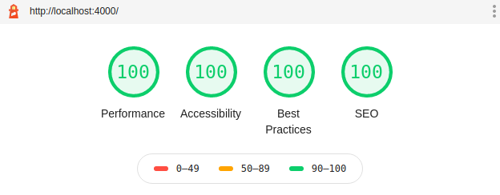
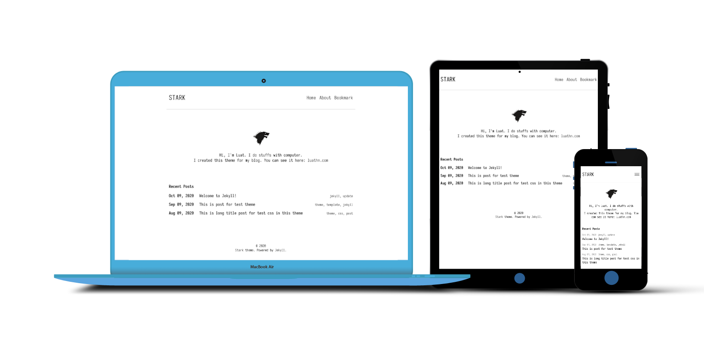

# Stark

Stark is minimal, elegant Jekyll theme for running a personal blog.

<p align="center">
  
</p>

<p align="center">
  
</p>

## Installation

Run local server:

```bash
$ git clone https://github.com/luathn/stark.git
$ cd stark
$ bundle install
$ bundle exec jekyll serve
```
